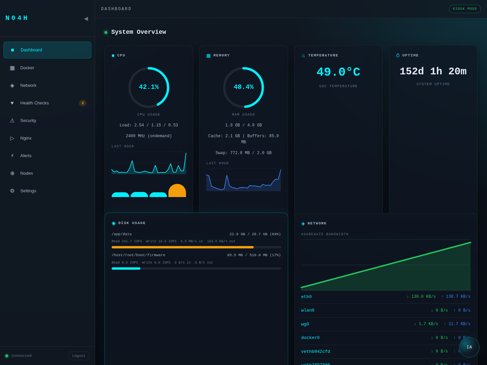

# PiGuard

Self-hosted monitoring dashboard for Raspberry Pi and small Linux hosts.

`PiGuard` gives you a clean web UI for host metrics, Docker visibility, service health checks, security posture, alerts, reverse-proxy activity, and an optional AI assistant for operational triage.



## Why This Exists

Most Raspberry Pi monitoring stacks are either too heavy, too generic, or too annoying to bootstrap.

This project is built around a simpler path:

- start one container
- open the UI
- complete a first-run wizard
- monitor the machine immediately

No manual database setup. No application config file to hand-edit. No need to define admin credentials, checks, or notifications in `.env`.

## Features

- **Real-time system overview** — CPU, memory, temperature, uptime, disks, processes, network rates
- **Docker monitoring** — container status, CPU/RAM usage, logs
- **Health checks** — HTTP, TCP, DNS, ICMP with uptime history and per-check intervals
- **Security panel** — SSH posture, firewall visibility, fail2ban, WireGuard, SSL certificate tracking
- **Alerts engine** — threshold-based rules with notification channels (ntfy, Telegram, webhook, email)
- **Reverse proxy visibility** — Nginx access/error parsing, top URIs, vhosts, WebSocket count
- **Optional AI assistant** — operational analysis, guided prompts, persistent conversations
- **First-run wizard** — admin account, instance name, language, health checks, notifications
- **Configurable identity** — custom instance name shown in sidebar, login, and browser tab
- **Six visual themes** — Cyber, Emerald, Rose, Amber, Hacker, Light
- **Lightweight stack** — Express, Lit Web Components, SQLite, WebSocket

## Stack

| Layer    | Technology                        |
| -------- | --------------------------------- |
| Backend  | Express + TypeScript + SQLite     |
| Frontend | Lit Web Components + Vite         |
| Database | SQLite (better-sqlite3)           |
| Auth     | JWT (jose) + Argon2id             |
| Realtime | WebSocket (ws)                    |
| Runtime  | Docker / Docker Compose           |

## Quick Start

```bash
git clone https://github.com/N04H2601/piguard.git && cd piguard
cp .env.example .env
docker compose up -d --build
```

Then open `http://<your-pi-ip>:3333` and complete the first-run wizard.

## First-Run Wizard

On a fresh install, the dashboard opens directly into a browser setup flow.

The wizard asks for:

- instance name (displayed in sidebar, login page, browser title)
- admin username and password
- default language (`fr` or `en`)
- initial health checks
- notification channels: ntfy, Telegram, webhook, SMTP email

When setup completes, the dashboard stores everything in SQLite, seeds the health checks, and signs the user in automatically.

## Configuration

### Container Environment (`.env`)

The `.env` file is intentionally small. It holds container-level and runtime values only.

| Variable              | Default              | Description                                  |
| --------------------- | -------------------- | -------------------------------------------- |
| `PORT`                | `3333`               | HTTP listen port                             |
| `NODE_ENV`            | `production`         | `production` or `development`                |
| `TZ`                  | `UTC`                | Container timezone                           |
| `DB_PATH`             | `./data/piguard.db`  | SQLite database path                         |
| `JWT_SECRET`          | random on boot       | JWT signing secret (auto-generated if empty) |
| `JWT_EXPIRY`          | `24h`                | Session duration                             |
| `LOG_LEVEL`           | `info`               | Pino log level                               |
| `GEOIP_PATH`          | `./data/geoip/...`   | MaxMind GeoIP database path                  |
| `NGINX_CONTAINER_NAME`| `nginx`              | Docker container name for nginx log parsing  |
| `OPENAI_API_KEY`      | —                    | Enable AI assistant (optional)               |
| `OPENAI_MODEL`        | `gpt-5.4`            | Model for the AI assistant                   |

### Application Settings (Web UI)

All application-level settings are configured from the web UI, not from `.env`:

- Instance name and language
- Admin password
- Notification channels (ntfy, Telegram, webhook, SMTP)
- Health checks
- Alert rules and thresholds
- Theme and display preferences
- API keys

## Notification Channels

| Channel   | Required Fields                          |
| --------- | ---------------------------------------- |
| ntfy      | URL, topic                               |
| Telegram  | bot token, chat ID                       |
| Webhook   | URL (receives JSON POST)                 |
| Email     | SMTP host, port, from, to (auth optional)|

All channels can be configured during initial setup or later from Settings.

## Docker Compose Notes

The default `docker-compose.yml` is tuned for Raspberry Pi and Linux host monitoring.

It mounts:

- `/proc` and `/sys` — host metrics
- `/` as `/host/root` — disk usage
- `/var/run/docker.sock` — Docker container monitoring

The container runs with `network_mode: host` and `NET_ADMIN` capability for network-level visibility (ICMP checks, interface stats).

## Reverse Proxy

The dashboard can run directly on port `3333` or behind Nginx, Caddy, Traefik, or another reverse proxy.

An example Nginx configuration is provided in [`nginx/example.conf`](nginx/example.conf).

Key requirements when proxying:

- Forward `/ws` with WebSocket upgrade headers
- Set `X-Real-IP` and `X-Forwarded-For` headers
- TLS termination is the responsibility of the reverse proxy

## Optional AI Assistant

The AI assistant is optional. If no OpenAI key is configured, the rest of the dashboard works normally.

```env
OPENAI_API_KEY=sk-...
OPENAI_MODEL=gpt-5.4
```

## Security Model

Protections:

- HTTP-only session cookie with `SameSite=strict`
- CSRF token validation for browser mutations
- Login rate limiting
- Passwords hashed with Argon2id
- API key hashes stored server-side (plaintext shown once on creation)
- Notification secrets stored server-side in SQLite
- Server-side API key usage for the AI assistant

Operational notes:

- TLS termination is the responsibility of your reverse proxy
- Mounting `/var/run/docker.sock` grants privileged host access
- The first-run wizard is locked after initial setup

## Development

```bash
npm install
npm run dev
```

This starts the Express server (with tsx watch) and Vite dev server concurrently.

Production build:

```bash
npm run build
npm start
```

## Architecture

```
piguard/
├── client/src/          # Lit Web Components frontend
│   ├── components/      # UI components (app-shell, sidebar, panels)
│   ├── lib/             # API client, utilities
│   └── state/           # Client state store, data sync
├── server/src/          # Express + TypeScript backend
│   ├── collectors/      # System metrics, Docker, Nginx log collectors
│   ├── database/        # SQLite schema, repositories
│   ├── middleware/       # Auth, rate limiting, security
│   ├── routes/          # REST API endpoints
│   └── services/        # Business logic (auth, alerts, health checks, notifications)
├── nginx/               # Example reverse proxy config
├── Dockerfile           # Multi-stage Docker build
└── docker-compose.yml   # Production compose file
```

## License

MIT
